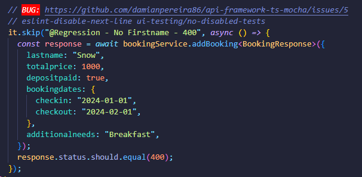
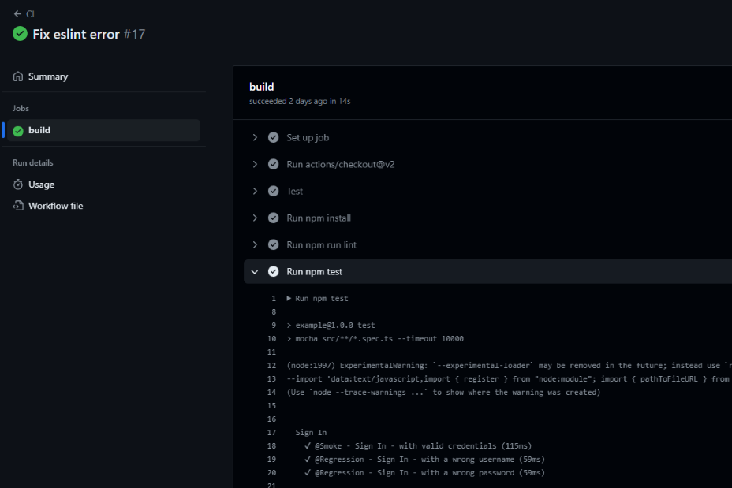

# API Automation Framework (Python+Pytest)

Python API automation framework that does its job in a simple but effective way. It is designed to work with HTTP APIs but can be adapted to work with other protocols.

Libraries used:

- Pytest - Test Runner
- Requests - HTTP client
- Python-dotenv - Environment management with .env files
- Flake8 - Linting
- Black - Formatting

This example uses the [Restful-booker](https://restful-booker.herokuapp.com/apidoc/index.html) API for demonstration purposes.

## Setup

Before you begin, make sure you have Python installed on your machine.

### Preparing your Environment

Before starting with the setup, ensure you have a local copy of the repository. Follow these steps to clone the repository and set up your environment:

1. Clone the repository to your local machine using the following command in your terminal:

   ```bash
   git clone https://github.com/damianpereira86/api-framework-ts-mocha.git

2. Navigate to the project directory on your terminal. This is where the `requirements.txt` file is located.

    ```bash
    cd api-framework-ts-mocha
    ```

3. Install the necessary dependencies by running the following command in the root folder:

    ```bash
    pip install -r requirements.txt
    ```

### Setting up your local environment

The `.env` file is used to store environment variables that are important for running your tests. By default, this file is not tracked by Git to prevent sensitive data like usernames and passwords from being shared publicly.

- Start by copying the `example.env` file provided in the project directory:

    ```bash
    cp example.env .env
    ```

- Open the `.env` file in your preferred text editor and update the following properties with your local environment values:

    ```yaml
    BASEURL=api_base_url
    USER=username
    PASSWORD=password
    ```

    Make sure to replace `api_base_url`, `username`, and `password` with the actual values you wish to use for testing. The `BASEURL` should point to the base URL of the API you are testing. `USER` and `PASSWORD` are used for scenarios where authentication is required.

**Note:** The values provided in the `example.env` file correspond to the [Restful-booker](https://restful-booker.herokuapp.com/apidoc/index.html) API used for demonstration purposes in this framework, which is a test API. I did it to make it frictionless to run the example tests. 
However, it is crucial to **never** commit these values or your personal environment variables to version control in a real project, as it can expose sensitive information.
    
### VS Code Extensions

Three VS Code extensions are recommended for this project. 

- Flake8 (ms-python.flake8): Linter
- Black (ms-python.black-formatter): Code formatter
- TODO Highlight (jgclark.vscode-todo-highlight): Bug management

They will be recommended to the user on the setup since they are set as recommendations on the extension.json file.

### Running the tests

```bash
# Runs all tests
pytest

# Runs tests by tag
pytest -m smoke
pytest -m regression
```

### Flake8

You can use flake8 with the help of the VS Code extension and with the following script.

```bash
flake8
```

### Black

Black is configured to run with flake8 and to format the code on each save. 
In case you want to run it separately use the following scripts:

- Check for issues:
    
    ```bash
    black --check .
    ```
    
- Resolve issues:
    
    ```bash
    black .
    ```
    
## Getting started

The idea behind this framework is to encapsulate endpoints on Service Models, for maintainability and reusability. You can think of Service Models as an analogy of Page Object Models for UI Automation.

## Service Models

In this framework, Service Models are used to encapsulate the API endpoints you are testing. This abstraction allows for better maintainability and reusability of your test code. The concept here is somewhat similar to the Page Object Model used in UI Automation, where each service model represents a specific set of functionality provided by your API.

### Understanding `ServiceBase`

The `ServiceBase` class is the foundation of all Service Models. It provides common functionality needed for making API requests and processing responses. When you create a new Service Model, it should extend `ServiceBase` to inherit these capabilities. This approach ensures consistency and reduces boilerplate code in your service models.

Here's what `ServiceBase` offers:

- **API Client Management**: It initializes and holds an instance of the `ApiClient`, ensuring that all service models use the same API client setup.
- **Base URL Configuration**: It dynamically sets the base URL for API requests using the `BASEURL` from your `.env` file. This allows for flexibility across different environments (e.g., development, staging, production).
- **Authentication**: The `authenticate` method simplifies the process of authenticating with the API. Once called, it stores the authentication token in the request headers, so subsequent API calls are authenticated. Note that as explained below in the [Authentication](#authentication) section, this is specific to this API, and must be adapted to your use case.
- **HTTP Methods**: `ServiceBase` provides methods for common HTTP requests (GET, POST, PUT, PATCH, DELETE, HEAD, OPTIONS). These methods handle the request execution and timing, then format the response into a standardized `Response` object, making it easier to work with.

### Extending `ServiceBase`

When you create a Service Model, you extend `ServiceBase` and define methods specific to the service you're testing. For example, a `BookingService` might have methods like `getBooking` or `createBooking`. Each method uses the HTTP methods provided by `ServiceBase` to interact with the API.

Here's a simple example of a service model:

```python
from src.base.ServiceBase import ServiceBase

class BookingService(ServiceBase):
    def __init__(self):
        super().__init__("/booking")

    def get_booking(self, id, config=None):
        return self.get(f"{self.url}/{id}", config)
```

By extending ServiceBase, BookingService gains all the functionalities of making HTTP requests, handling authentication, and standardizing responses, allowing you to focus on the logic specific to the Booking service.

### Other Models

In addition to **Service Models**, you should declare **Request** and **Response** models as needed. For example, here is the BookingModel that will be used to deserialize the response from the endpoint above.

```python
class BookingModel:
    def __init__(self, id=None, firstname=None, lastname=None, totalprice=None, depositpaid=None, bookingdates=None, additionalneeds=None):
        self.id = id
        self.firstname = firstname
        self.lastname = lastname
        self.totalprice = totalprice
        self.depositpaid = depositpaid
        self.bookingdates = bookingdates
        self.additionalneeds = additionalneeds
```

## Tests

Next, you can create a simple test like this. 

```python
import pytest
from src.models.services.BookingService import BookingService

@pytest.fixture
def booking_service():
    return BookingService()

def test_get_booking_successfully(booking_service):
    booking_id = 123456
    response = booking_service.get_booking(booking_id)
    assert response.status == 200
```

Note the BookingModel on the generic get_booking function. With that in place, you can easily assert against the response body properties.

```python
def test_get_booking_successfully(booking_service):
    booking = booking_service.add_booking({
        "firstname": "Damian",
        "lastname": "Pereira",
        "totalprice": 1000,
        "depositpaid": True,
        "bookingdates": {
            "checkin": "2024-01-01",
            "checkout": "2024-02-01"
        },
        "additionalneeds": "Breakfast"
    })

    booking_id = booking.data["bookingid"]

    response = booking_service.get_booking(booking_id)
    assert response.status == 200
    assert response.data["firstname"] == booking.data["booking"]["firstname"]
    assert response.data["lastname"] == booking.data["booking"]["lastname"]
    assert response.data["totalprice"] == booking.data["booking"]["totalprice"]
    assert response.data["depositpaid"] is True
    assert response.data["bookingdates"]["checkin"] == booking.data["booking"]["bookingdates"]["checkin"]
    assert response.data["bookingdates"]["checkout"] == booking.data["booking"]["bookingdates"]["checkout"]
    assert response.data["additionalneeds"] == booking.data["booking"]["additionalneeds"]
```

In the example above, I am using a call to the add_booking endpoint to create the booking needed for the get_booking test, and then using the newly created booking to assert against it.

## Performance

Request duration is measured and saved to the response_time property of the response object. Therefore, you can add assertions to check the response time of each request.

```python
def test_get_booking_successfully_response_time(booking_service):
    booking_id = 123456
    response = booking_service.get_booking(booking_id)
    assert response.response_time < 1000
```

This makes adding simple but powerful performance checks to your API automation suite easy.

## Authentication

The authentication process depends on the method required by the API, but in most cases, it involves sending tokens in the request headers.

In this repository, the API uses an `/auth` endpoint to obtain a token, which is then sent in the request headers as a cookie. To streamline this process, I’ve added an `authenticate()` method in the `ServiceBase` class, making it easy to authenticate with the API.

Additionally, the token is cached so that subsequent calls to `authenticate()` from any service do not result in unnecessary requests to the server.

Here’s the implementation of the `authenticate()` method:

```python
import os
from src.models.request.CredentialsModel import CredentialsModel
from src.models.responses.SessionResponse import SessionResponse
from src.base.SessionManager import SessionManager

class ServiceBase:
    def __init__(self, endpoint_path):
        self.api = ApiClient.getInstance()
        self.url = self.base_url + endpoint_path
        self.default_config = {}

    @property
    def base_url(self):
        return os.getenv("BASEURL", "")

    def authenticate(self):
        username = os.getenv("USER")
        password = os.getenv("PASSWORD")

        if not username or not password:
            raise ValueError("Missing username or password in environment variables.")

        cached_token = SessionManager.get_cached_token(username, password)

        if cached_token:
            self.default_config = {
                "headers": {"Cookie": "token=" + cached_token}
            }
            return

        credentials = CredentialsModel(username, password)
        response = self.post(f"{self.base_url}/auth", credentials)

        SessionManager.store_token(username, password, response.data["token"])

        self.default_config = {
            "headers": {"Cookie": "token=" + response.data["token"]}
        }
```

Then you can use it on the services that require authentication, like in the before hook below.

```python
import pytest
from src.models.services.BookingService import BookingService

@pytest.fixture
def booking_service():
    service = BookingService()
    service.authenticate()
    return service

def test_delete_booking_successfully(booking_service):
    response = booking_service.delete_booking(booking_id)
    assert response.status == 204
```

## Bug Management

I have found that the strategy for dealing with open bugs on an automation project is not a solved problem, and you can find different views on this. This repo has an approach I have used in different projects, but feel free to adapt it to yours.

In this case, bugs are skipped while open, to maintain a green pipeline. The issue with this approach is that you have to have a process in place to un-skip them when they are fixed.

To do that, I add a comment on top of the test before skipping it, containing the link to the test and a visual indication with the help of the TODO Highlight extension.

To avoid unwanted skipped tests, I set an flake8 rule to not allow them. Hence, besides the BUG comment, I have to add one to disable flake8 for the next line. This makes it easier not to forget skipped or focused tests while helping the PR review process for the reviewer (a disabled flake8 rule must have a good justification)



## CI / CD

This repository utilizes GitHub Actions for continuous integration and delivery (CI/CD). Our pipeline is configured to run all tests on each Pull Request or Merge to the main branch. Here is what typically happens:

1. **Linting**: The pipeline runs Flake8 to check for syntax errors and enforce code style guidelines.
2. **Testing**: It executes the automated tests defined in the repository.
3. **Deployment (Optional)**: If all tests pass, the pipeline can automatically deploy your code to the production environment.

Check the [Actions](https://github.com/damianpereira86/api-framework-ts-mocha/actions) tab to see passed and failed pipelines.



Ensure that you configure any necessary environment variables and secrets. These can be managed in the repository’s **Settings** under **Secrets and variables**.
1. Repository Variables: Go to Settings > Secrets and variables > Actions > Variables. (e.g., BASEURL)
2. Repository Secrets: Go to Settings > Secrets and variables > Actions > Secrets.(e.g., USER and PASSWORD)

You can customize the CI/CD pipeline to suit your project's needs. For example, you can adjust which branches trigger the pipeline, add steps for deployment, or configure notifications.

To get started with GitHub Actions in your project, check out the `.github/workflows` directory in this repository. Here, you'll find the workflow files that define our CI/CD processes. You can modify these files to change the pipeline or add new workflows.

See branch `features/two-step-pipeline` as an example of a pipeline that does the following:
1. Runs the Smoke tests, and fails in case any test fails, 
2. Runs the Regression tests, that do not make the pipeline fail.

### Linting in the pipeline
As mentioned above, this job will run Flake8 before running the tests. In the following screenshot, the pipeline failed due to an flake8 error.


For more detailed examples and advanced features, refer to the [GitHub Actions Documentation](https://docs.github.com/en/actions).

## Extensions

This framework has been extended in the past with different features such as:

- Reporter
- Schema validation
- Improved Logging
- Database integration
- And so on...

But each of them depends on the project needs, the tools of choice, etc. Hence, I’ll be adding examples of possible extensions that could be useful for some of you, while leaving this repo as light and straightforward as possible.

## Next steps

Now it’s time to use it. Go ahead and explore the test examples in this repo and adapt it to your use case. I’m sure there are much better ways to tackle some of the features of this framework, and I will be more than happy to hear them and include them in the repo. Or better, you can include them yourself!

## Contact/Support

If you have any questions, encounter any issues, or simply want to provide feedback regarding this project, I'm here to help and listen!

Here are a few ways you can reach out for support or assistance:

- **Submit an Issue**: If you find any bugs or issues, feel free to open an issue on the [GitHub issues page](https://github.com/damianpereira86/api-framework-ts-mocha/issues). Please provide as much detail as possible to help me understand and address the problem quickly.

- **Discussions**: For questions, suggestions, or general discussions about the project, please use the [Discussions](https://github.com/damianpereira86/api-framework-ts-mocha/discussions) section of the GitHub repository. This is a great place to connect with other users and contributors, share ideas, and get advice.

- **Email**: If you prefer direct communication, you can email me at [damianpereira@gmail.com](mailto:damianpereira@gmail.com). I'll try to respond as promptly as possible.

## Contribution Guidelines

I welcome contributions from everyone and value your input and ideas. Here's how you can contribute:

1. **Fork the Repository**: Begin by forking the repository to your GitHub account. This creates your own copy of the project where you can make your changes.

2. **Clone the Forked Repo**: Clone the forked repository to your local machine to start working on the changes.

    ```bash
    git clone https://github.com/YOUR_USERNAME/YOUR_FORKED_REPO.git
    ```

3. **Create a New Branch**: Create a new branch on your local repository for each set of changes you want to make. This keeps your modifications organized and separate from the main project.

    ```bash
    git checkout -b your-new-branch-name
    ```

4. **Make Your Changes**: Implement your changes, fix a bug, add a new feature, or update documentation as needed in your new branch.

5. **Commit Your Changes**: Commit your changes with a clear and descriptive commit message. This message should explain what you've done and why.

    ```bash
    git commit -m "Add a concise but descriptive commit message"
    ```

6. **Push Changes to Your Fork**: Push your changes to your fork on GitHub.

    ```bash
    git push origin your-new-branch-name
    ```

7. **Submit a Pull Request**: Go to your fork on GitHub and click the 'New pull request' button. Select the original repository as the base and your branch as the compare. Fill in the pull request with a title and description that explains your changes.

8. **Wait for Review**: Wait for the review of your changes. Be ready to make additional changes based on the feedback.

9. **Merge**: Once your changes have been approved, they will be merged into the main project.

Please ensure that your code adheres to the project's standards and has passed all tests. 

I look forward to your contributions. Thank you!

## License

This project is licensed under the MIT License - see the [LICENSE](LICENSE.txt) file for details.
